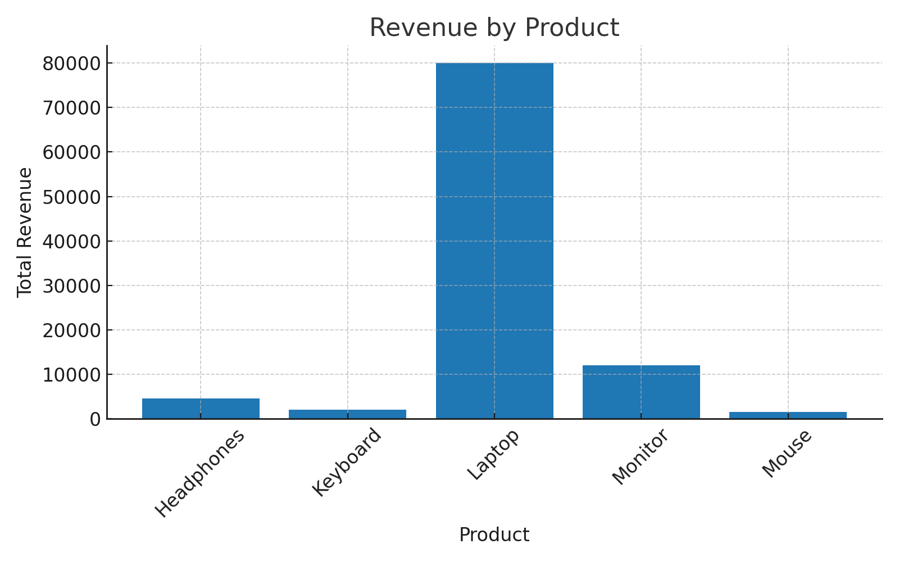

# task-7
Get Basic Sales Summary from a Tiny SQLite Database using Python

Basic Sales Summary from SQLite Database

## Objective
Use SQL inside Python to pull simple sales info (total quantity sold, total revenue) from a SQLite database, and display it using print statements and a basic matplotlib bar chart.

## Dataset
`sales_data.db` containing one table: `sales`

| order_id | order_date | product     | quantity | amount |
|----------|------------|-------------|----------|--------|
| 1        | 2025-08-01 | Laptop      | 1        | 80000  |
| 2        | 2025-08-02 | Mouse       | 2        | 1500   |
| 3        | 2025-08-02 | Keyboard    | 1        | 2000   |
| 4        | 2025-08-03 | Monitor     | 1        | 12000  |
| 5        | 2025-08-04 | Headphones  | 3        | 4500   |

## Steps
1. Connect to SQLite database using `sqlite3`.
2. Run SQL query to calculate total quantity and revenue per product.
3. Load results into a pandas DataFrame.
4. Print the summary.
5. Plot a bar chart showing revenue by product.

## Output
### Sales Summary
| Product     | Total Quantity | Total Revenue |
|-------------|---------------|---------------|
| Headphones  | 3             | 4500          |
| Keyboard    | 1             | 2000          |
| Laptop      | 1             | 80000         |
| Monitor     | 1             | 12000         |
| Mouse       | 2             | 1500          |

### Chart

## Requirements
- Python 3
- pandas
- matplotlib
